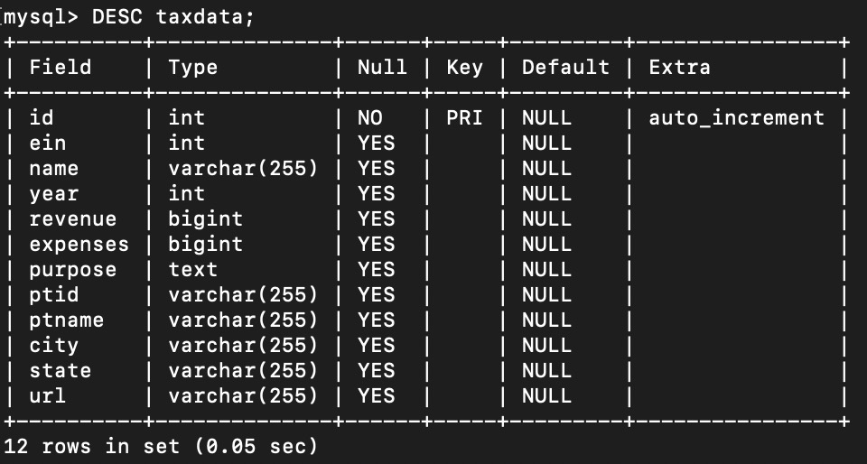
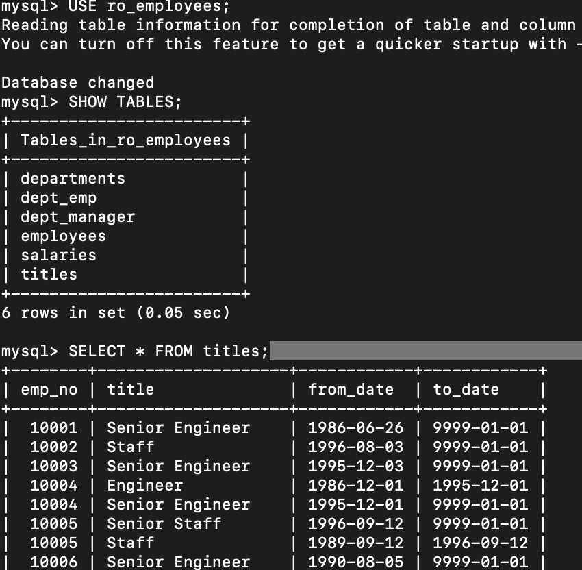

# Homework 1

**SUBJECT**: RE: Welcome to Borromean Team!  
**FROM**: [Jonas Zhonghan Xie](mailto:jonasxie@umich.edu)  
**TO**: Raj Kumar

Hi Raj,

Thank you for your email. I am also really excited to be part of the Borromean Team and working with you!

For your questions in Part 1:
1. The author defines three types of relationships in the reading: one-to-one, one-to-many, and many-to-many.
2. Similar relationships can be students to classes: one student enrolls in one class or multiple classes. There are many students in one single class. Also, for the example of schools and alumni, one student can be alumnus of multiple schools. A school can have many alumni.
3. There are two types of databases mentioned in the reading: operational database and analytical database. Operational databases are powerful for transactional processing. We may use this type of databases for daily operations. Analytical databases are more suitable for data analysis and reporting. We may want to use analytical database to pull, analyze data for business intelligence.

For questions in Part 2: I was able to connect to the MySQL server and found the following databases with the command `SHOW DATABASES;`. There are 14 databases on the server.

For the tables in `ro_query`, I only found 2 tables in the database. They are `home_value_by_zip` and `taxdata`. Probably there are something wrong with the database or my query. Please point me to the right direction if I missed anything.

In the `taxdata` table, there are 12 columns in the table.

There are 443308 rows in the `titles` table.

