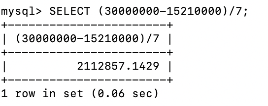
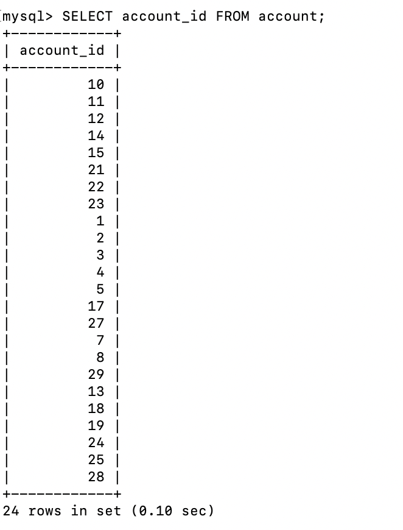

# Homework 2

**SUBJECT**: RE: Welcome to your second week at Borromean!  
**TO**: Kelly Davenport (CTO)  
**FROM**: Jonas Zhonghan Xie (Database Team)  

Hi Kelly,

Thank you for your email! I am more than delighted to be part of Borromean. I attached my answers and the data dictionaries for the tables to this email.

**Part 1**
1. Every investor will pay about $2,112,857 for the share of the company.
  

**Part 2**

1.  There are 24 accounts in the `account` dataset.  

2. The primary key of the `account` table is `account_id`. The description of `account` is shown below:

3. As you can see from the description of the `account` table above, the status of the accounts can be ACTIVE, CLOSED or FROZEN. But in the `account` table, the accounts are all ACTIVE.

**Part 3**

1. The employee who has the ID `1` has opened the most accounts. The employee has opened 8 accounts.

2. The top-performing employee who has the ID `1` started working the company on June 22, 2001.

**Part 4**

1. The recent transaction date and the accounts are shown below:

2. The primary key of the `transaction` table is `txn_id`. The description of `transaction` is shown below:

**Part 5**

1. About the branches, there are 3 branches are located in Massachusetts.

2. The name, address and the ZIP code of the branches are listed below. I also attached the query time as a field below.

I also created the data dictionaries for the tables mentioned above: `account`, `employee`, `transaction`, and `branch`. You can find the data dictionary in each sheet in the Excel file which is attached to this email. Please let me know if you have any questions or additional data request for the next steps. 

For Raj's question, it took me about half to an hour to complete the task and create the data dictionaries. I haven't heard from him about his farm business yet. But it really sounds interesting to run a farm!

Thank you again!

Best,
Jonas