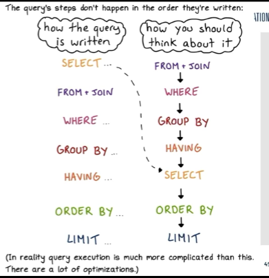

# Quick Notes for SI564
SQL and Databases  

- [Quick Notes for SI564](#quick-notes-for-si564)
  - [Week 1](#week-1)
  - [Week 2](#week-2)
  - [Week 3](#week-3)
    - [WHERE clauses](#where-clauses)
    - [Subqueries](#subqueries)
    - [NOT operator](#not-operator)
    - [NULL](#null)
    - [Date](#date)
    - [SLEEP()](#sleep)
    - [COUNT()](#count)
  - [Week 4](#week-4)
    - [Aggregate Functions](#aggregate-functions)
  - [Week 5](#week-5)
    - [GROUP BY](#group-by)
    - [HAVING](#having)
  - [Notes before Midterm](#notes-before-midterm)
  - [Week 9](#week-9)
    - [Save MySQL Database](#save-mysql-database)

## Week 1

Basic Queries describing databases and tables.  
`SHOW DATABASES;` shows all the databases on a server  
`USE database_name;` selects a database to use  
`SHOW TABLES;` shows all the tables in a database  
`DESCRIBE table_name;` shows the columns in a table  
`SELECT * FROM table_name;` shows all the rows in a table  
`SELECT column_name FROM table_name;` shows all the rows in a column

## Week 2

Structured Query Language: `__VERB__ WHAT FROM LOCATION WHERE CONDITION;`
4 basic queries in SQL:
- `SELECT`
  - Get data from the database for display: `SELECT (*) FROM table_name;`
  - Not all queries select data from a database
    - `SELECT NOW()` returns the current time.
    - `SELECT 2+2` returns 4.
  - Rather than query all the data, choose the specific fields of interest.
  - Use `AS` to rename columns or tables: `SELECT column_name AS new_name FROM table_name AS new_table_name;`
  - `DISTINCT` is used to return unique values in a column. `SELECT DISTINCT column_name FROM table_name;`
  - `LIMIT` is used to limit the number of rows returned. `SELECT column_name FROM table_name LIMIT 5;`
      - `LIMIT` should be the last part of the query to avoid limiting the results.
  - `ORDER BY` is used to sort the results. `SELECT column_name FROM table_name ORDER BY column_name ASC/DESC;`
    - We can also order by functions, e.g. `ORDER BY LENGTH(column_name) DESC;` or `ORDER BY RAND();`
- CRUD: Create, Read, Update and Delete
- `WHERE` 

**Everything you do should have a documentation behind it.**
- It has to be clear and communicative.
- It needs to ensure that the next person can understand what you did.
- If you don't have a documentation, create one.

**Primary keys**: unique identifier for each row in a table.

## Week 3

### WHERE clauses

`WHERE` applies to `SELECT`, `UPDATE`, `DELETE` and `INSERT` statements.
- `SELECT column_name FROM table_name WHERE condition;`

`conditions` use **single** equal sign.

We can use `BETWEEN .. AND ...` to select a range of values.

`LIKE` is used to search for a specified pattern in a column.  
- `%` is a wildcard character that represents zero or more characters.
- `_` is a wildcard character that represents a single character.
- `\` is used to escape special characters.
- Use `REGEXP` for regular expression matching.
- `LIKE` is case-**insensitive**. `%states` matches `United States` and `United states`.
- E.g. `SELECT column_name FROM table_name WHERE column1 LIKE 'a%' AND column2 LIKE '%b';`
- `LIKE` can be slow in matching.
- DON'T use `LIKE` for exact matches as `LIKE` operator is not efficient.

### Subqueries

A subquery is a query nested in another query. Another query result serves as the condition as the main query. For example, `SELECT column_name FROM table_name WHERE column_name IN (SELECT column_name FROM table_name WHERE condition);`  
The column in the main query should be matched with the column in the subquery.

Subqueries can only return **one** field. Field selected in subquery needs to be the same as the field in the `WHERE` statement.

### NOT operator
`NOT` is used to negate a condition but not in logical expressions.
- `NOT` can be used in `IN`, `BETWEEN...AND...`, `LIKE`, `NULL`
- `NOT` **cannot** be used in `NOT =` or any arithmetic logical expression.

### NULL

`NULL` is a special value that represents missing data.  
`IS NULL` or `IS NOT NULL`  
Empty string `''` is not the same as `NULL`.  

### Date

`DATE` is a data type that stores the date.
- `SELECT DATE('2020-01-01');` returns `2020-01-01`.
- `SELECT NOW();` returns the current date and time.
- `SELECT CURDATE();` returns the current date.
- `SELECT CURTIME();` returns the current time.

We can also select the year, month and day from a date.
- `SELECT YEAR('2020-01-01');` returns `2020`.
- `SELECT MONTH('2020-01-01');` returns `1`.
- `SELECT DAY('2020-01-01');` returns `1`.
- These functions can also be used in `WHERE` clauses.
  - `SELECT column_name FROM table_name WHERE YEAR(column_name) = 2020;`

`DATE_FORMAT()` is used to format dates.
- `SELECT DATE_FORMAT('2020-01-01', '%Y-%m-%d');` returns `2020-01-01`.
- Also we can use `STR_TO_DATE()` to convert a string to a date.
  - `SELECT STR_TO_DATE('2020-01-01', '%Y-%m-%d');` returns `2020-01-01`.

### SLEEP()
`SLEEP()` is used to pause the execution of a query for a specified number of seconds.
- `SELECT SLEEP(5);` pauses the execution for 5 seconds.

### COUNT()
`COUNT()` is used to count the number of rows in a table.
- `COUNT(*)` returns the total number of rows in a table.
- `COUNT(column)` returns the number of non-NULL values in a column.
- `SELECT COUNT(1) AS total_count FROM table_name;` returns the total number of rows in a table and renames the column as `total_count`.

**Use `COUNT(1)` instead**. Don't use `COUNT(*)` to count the number of rows in a table as it is not efficient. It pulls all the data from the database and counts the observations. 

## Week 4

### Aggregate Functions

- `SUM()`: returns the sum of a numeric column.
- `AVG()`: returns the average of a numeric column.
- `COUNT()`: returns the number of rows in a table.

## Week 5

### GROUP BY

Aggregation Functions applied with `GROUP BY` clause. Summarize those values after GROUP BY.
- `COUNT()`
- `SUM()`
- `AVERAGE()`/`AVG()`
- `MAXIMUM()`
- `MINIMUM()`

Example queries:
`SELECT Continent, AVG(Population) FROM Country GROUP BY Continent;`

When `GROUP BY` joined tables, `GROUP BY` the field in the primary table.

### HAVING

`HAVING` is used to filter the results of a `GROUP BY` clause.

`SELECT Continent, AVG(Population) FROM Country GROUP BY Continent HAVING AVG(Population) > 500000;`

## Notes before Midterm

Subqueries can only return **one** field. Field selected in subquery needs to be the same as the field in the `WHERE` statement.

Aggregate function can not be used inside an aggregate function.

Empty string `''` is **not** the same as `NULL`.
- Use `IS NULL` or `IS NOT NULL` to check for `NULL` values.

How to check answers?
- Add a field in the SELECT clause
- Check for typos, missing part of the query or magic quotes
- Read error messages

## Week 9

### Save MySQL Database

`mysqldump -h <host> --port <port> -u <username> -p<password> <database> --set-gtid-purged=OFF > <filename.sql>`

Use this on the notebook server on Canvas can dump and download the database file.

Upload database to MySQL Server: 

`mysql -h <host> --port <port> -u <username> -p<password> <database> < <filename.sql>` // Different direction of `<` and `>`.

