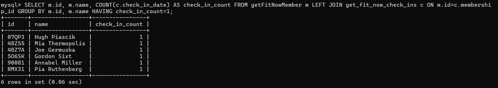

# Midterm

## Part 1

select id, name from persons order by id limit 10;

select person_id FROM Interview ORDER BY person_id LIMIT 20;

select date from fieldReports LIMIT 10;

select date, type, description, city FROM fieldReports where date=20180115 and city='Big Ten City' LIMIT 20;

select id, name, address_number, address_street_name FROM persons WHERE address_street_name = 'Northwestern Dr' ORDER BY address_number DESC LIMIT 1

select i.person_id, i.transcript FROM Interview i JOIN persons p ON i.person_id=p.id WHERE p.address_street_name='Northwestern Dr' ORDER BY p.address_number DESC LIMIT 1;

SELECT DISTINCT membership_status FROM getFitNowMember;

SELECT p.id, p.name, p.license_id, m.membership_status FROM persons p JOIN getFitNowMember m ON p.id=m.person_id WHERE m.id LIKE '48Z%' AND m.membership_status='gold' LIMIT 10;

SELECT p.id, p.name, m.membership_status, m.id AS member_id, d.plate_number FROM persons p JOIN getFitNowMember m ON p.id=m.person_id JOIN driversLicense d ON p.license_id=d.id WHERE m.id LIKE '48Z%' AND m.membership_status='gold' AND d.plate_number LIKE 'H42W%';

SELECT p.id, p.name, m.membership_status, m.id AS member_id, d.plate_number FROM persons p JOIN getFitNowMember m ON p.id=m.person_id JOIN driversLicense d ON p.license_id=d.id WHERE m.id LIKE '48Z%' AND m.membership_status='gold';

SELECT p.name, p.address_street_name, i.transcript FROM persons p JOIN Interview i ON p.id=i.person_id WHERE p.address_street_name = 'Franklin Ave' AND p.name LIKE '%Annabel%';

SELECT p.name, c.check_in_date FROM persons p JOIN getFitNowMember m ON p.id=m.person_id JOIN get_fit_now_check_ins c ON m.id=c.membership_id WHERE c.check_in_date = '20180109';

SELECT p.id, p.name, m.membership_status, m.id AS member_id, d.plate_number, c.check_in_date FROM persons p JOIN getFitNowMember m on p.id=m.person_id JOIN driversLicense d ON p.license_id=d.id JOIN get_fit_now_check_ins c ON m.id=c.membership_id WHERE m.id LIKE '48Z%' AND m.membership_status='gold' AND d.plate_number LIKE '%H42W%' AND c.check_in_date = '20180109';

SELECT event_name, date FROM facebookEventCheckIn WHERE event_name LIKE '%SQL%Symphony%' LIMIT 20;

SELECT DISTINCT car_make FROM driversLicense LIMIT 50;
SELECT DISTINCT hair_color FROM driversLicense;

SELECT p.id, p.name, i.annual_income, d.hair_color, d.gender, d.car_make, d.car_model, f.event_name, f.date FROM persons p JOIN driversLicense d ON p.license_id=d.id JOIN incomes i ON p.ssn=i.ssn JOIN facebookEventCheckIn f ON p.id=f.person_id WHERE d.hair_color='red' AND d.car_make='Tesla' AND  d.car_model='Model S' AND f.event_name='SQL Symphony Concert' AND f.date BETWEEN 20181201 AND 20181231;

SELECT p.id, p.name, i.annual_income, d.hair_color, d.gender, d.car_make, d.car_model, f.event_name, f.date FROM persons p JOIN driversLicense d ON p.license_id=d.id JOIN incomes i ON p.ssn=i.ssn JOIN facebookEventCheckIn f ON p.id=f.person_id WHERE d.hair_color='red' AND d.car_make='Tesla' AND  d.car_model='Model S' AND f.event_name='SQL Symphony Concert' AND f.date BETWEEN 20171201 AND 20171231;

SELECT p.id, p.name, i.annual_income, d.hair_color, d.gender, d.car_make, d.car_model, f.event_name, f.date FROM persons p JOIN driversLicense d ON p.license_id=d.id JOIN incomes i ON p.ssn=i.ssn JOIN facebookEventCheckIn f ON p.id=f.person_id WHERE d.car_make='Tesla' AND  d.car_model='Model S' AND f.event_name='SQL Symphony Concert' AND f.date BETWEEN 20181201 AND 20181231;

Suspect: Charlize Theron

## Part 2

SELECT m.id, m.name, COUNT(c.check_in_date) AS check_in_count FROM getFitNowMember m LEFT JOIN get_fit_now_check_ins c ON m.id=c.membership_id GROUP BY m.id, m.name HAVING check_in_count=1;

SELECT city, COUNT(city) AS report_count FROM fieldReports GROUP BY city ORDER BY report_count DESC LIMIT 5;

annual income total by street, average income by street, max income by street
top 5 in average income

SELECT p.address_street_name AS street, SUM(i.annual_income) AS total_income, AVG(i.annual_income) AS avg_income, MAX(i.annual_income) AS max_income FROM persons p JOIN incomes i ON p.ssn=i.ssn GROUP BY street ORDER BY total_income DESC LIMIT 5;

SELECT ssn, annual_income FROM incomes ORDER BY annual_income DESC LIMIT 1;

SELECT DISTINCT p.name, i.annual_income FROM persons p JOIN facebookEventCheckIn f ON p.id=f.person_id JOIN Interview iv ON p.id=iv.person_id JOIN incomes i ON p.ssn=i.ssn WHERE annual_income>100000;

SELECT id, height, eye_color FROM driversLicense WHERE id IN (SELECT license_id FROM persons WHERE address_number=3);